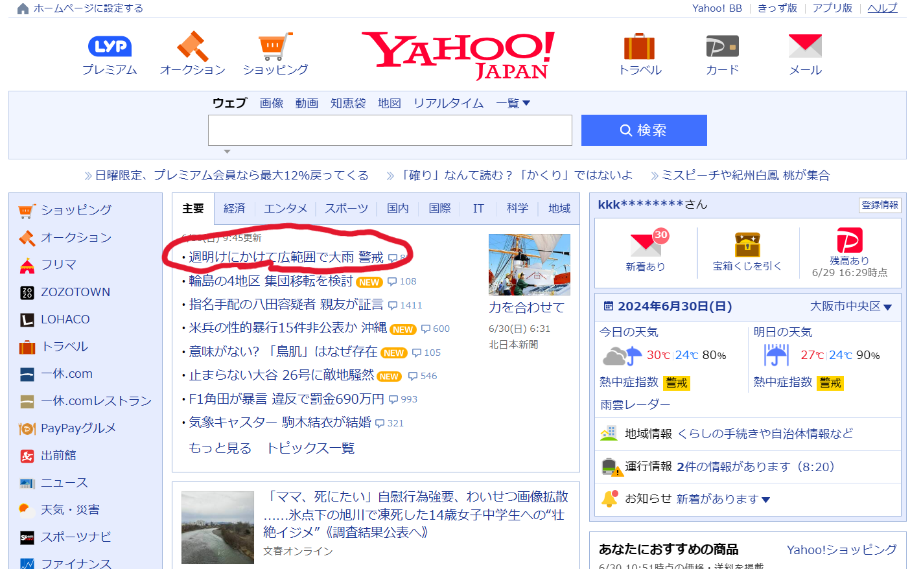
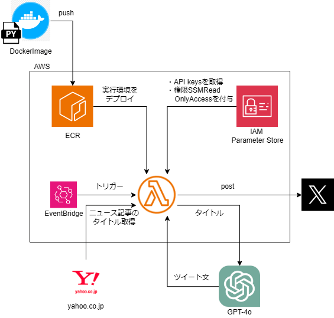
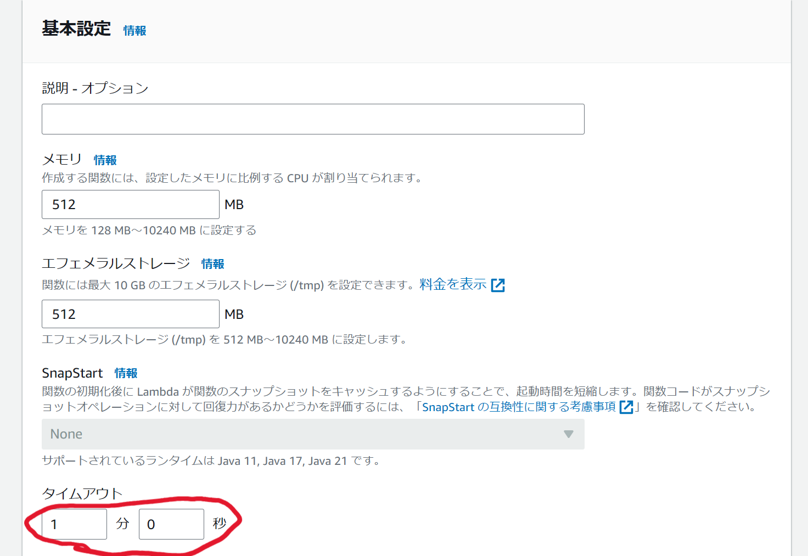

## 目次
1. システムについて
2. システム構成、使用技術
3. システム詳細
4. 環境構築

## 1. システムについて
### 1.1 概要
- このシステムは、GPTを用いてSNSへの投稿文を自動生成し、Xにポストするまでを全自動で行うものです。投稿文のテーマはyahooのタイムラインの1番上位のものを使用しています。

### 1.2 理念
- SNSを用いたマーケティングや広報を自動化できないかという着眼点の下開発しました。
- yahooのテーマ以外にも、個々の目的によってテーマを変えることで、利用範囲が広がると考えています。

## 2. システム構成、使用技術

| カテゴリ | スタック | 
|-----------|-----------| 
| 使用言語 | python 3.12.3 |
| ライブラリ | selenium, langchain, OpenAI API, tweepy(X API) |
| 環境 | AWS(lambda, ECR, parameter store), Docker|

## 3. システム詳細
### 3.1 yahooからのスクレイピング
- seleniumでスクレイピングすることでキーワードを取得
- lambda用のchrome driverをDLする必要あり（参考URL:[https://github.com/umihico/docker-selenium-lambda](https://github.com/umihico/docker-selenium-lambda)）
### 3.2 ポスト文の生成 → Xにポスト
- langchainのmemory機能を用いて、GPTとの会話を記憶できるようにした
### 3.3 備考
- プロンプトについては、まだ改善の余地があります。。。
- 今回はモデルを"gpt-3.5-turbo"で行いましたが、"gpt-4o"などを使うと、さらに精度の良い出力が得られるかも知れません。
- APIはAWSのパラメータストアから取り出す形式にしていますが、コードに直接書いてもらっても動作はします。ただし、API keyをそのままコードに書くのはセキュリティ上おすすめできません。
  
## 4. 環境構築
- dockerとAWS CLIが使用できること、既にOpenAIAPI, X APIのAPIキーを取得していることが前提です。
- 流れは以下のとおりです。
dockerimageの作成 → AWS ECR にimageをpushするためのタグをdockerimageに設定 → ECRにpush → lambdaにpushしたECRをデプロイ
- lambdaにAPI keyを取得するためのIAMロール権限を付与するのを忘れがちになるので注意してください。（参考URL：[https://dev.classmethod.jp/articles/sugano-039-ssm-paramstore-lambda/](https://dev.classmethod.jp/articles/sugano-039-ssm-paramstore-lambda/)）
- 関数の実行が完了するのに30秒ほど時間がかかるので、lambdaの設定 → 一般設定 → タイムアウトを1分程度に変更してください。

