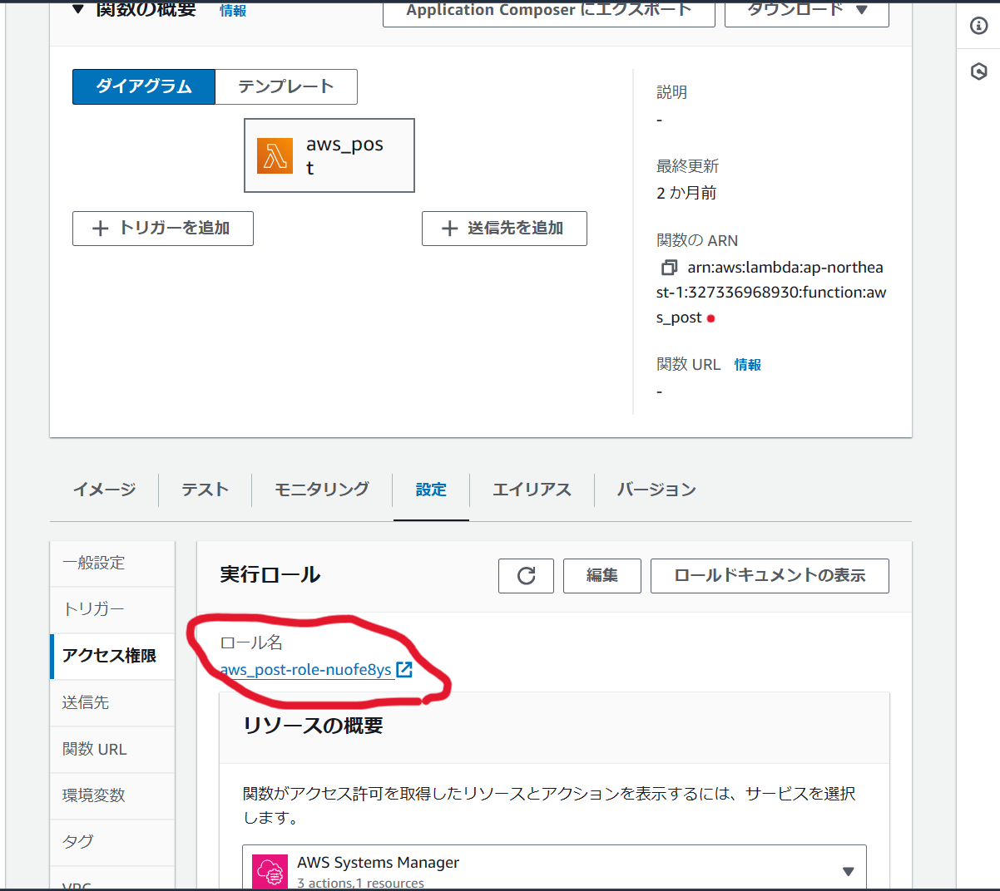

## 目次
1. システムについて
2. システム構成、使用技術
3. システム詳細
4. 環境構築
5. 実際に動かしてみて
6. 今後の構想

## 1. システムについて

実際のXアカウント：https://x.com/stasol_py

※ 現在は凍結されています。

### 1.1 概要
- このシステムは、GPTを用いてSNSへの投稿文を自動生成し、Xにポストするまでを全自動で行うものです。投稿文のテーマはyahooのタイムラインの上位のものをランダムに使用しています。

### 1.2 理念
- SNSを用いたマーケティングや広報を自動化できないかという着眼点の下開発しました。
  - まずは、インプレッションを上げようという考えのもと、yahooのトレンドを題材に投稿文を作成しています。
- yahooのテーマ以外にも、個々の目的によってテーマを変えることで、利用範囲が広がると考えています。

## 2. システム構成、使用技術

| カテゴリ | スタック | 
|-----------|-----------| 
| 使用言語 | python 3.12.3 |
| ライブラリ | selenium, langchain, OpenAI API, tweepy(X API) |
| その他技術 | AWS(lambda, ECR, parameter store), Docker|

## 3. システム詳細

- システム詳細
  - なぜlambdaを採用したのか？
    - 今回は複雑な関数を動かさないため。
    - 他のクラウド技術もあるが、まずは勉強の意味も込めて、有名なAWS lambdaを使用した。
  - なぜECRを採用したのか？
    - lambdaで直接プログラムを書く方法だと、ライブラリの扱いが大変（レイヤーやライブラリの容量など考えることが多い）。
    - ローカルで動くものをdockerimageにして、lambda上でデプロイしたほうが楽
  - yhaooからのスクレイピング
  - 文章の生成
    - ハッシュタグや、URLも使用
  - APIKeyパラメータ
    - 保存方法として、parameter storeを使用

### 3.1 なぜlambdaを採用したのか？
- サーバーレスで定期実行するため、クラウドで関数を動かしたかった。
- 他のクラウド技術もあるが、まずは勉強の意味も込めて、クラウドの中でも特に有名なAWS lambdaを使用した。

### 3.2 なぜECRを採用したのか？
- lambdaで直接プログラムを書く方法だと、ライブラリの扱いが大変（レイヤーやライブラリの容量など考えることが多い）。
- ローカルで動くものをdockerimageにして、lambda上でデプロイしたほうが楽だから。

### 3.3 yahooからのスクレイピング
- seleniumでスクレイピングすることでキーワードを取得
- lambda用のchrome driverをDLする必要あり（参考URL:[https://github.com/umihico/docker-selenium-lambda](https://github.com/umihico/docker-selenium-lambda)）

### 3.4 APIキーの取り扱い
- APIキーは、プログラムにそのまま書くと、セキュリティの観点からあまりよくない。
  - なので、別に管理する方法として、AWSのparameter storeを使用した。
- 使用方法
1. AWSでSystem Managerを選択
2. 左の選択画面から、パラメータストアを選択 .png)
3.  パラメータを作成を選択 .png)
4. 各パラメータを設定
   1. 名前：任意に設定（このプログラムでは、"/credential/APIkey"）
   2. タイプ：安全な文字列
   3. 値：辞書型で設定(画像では空白ですが、各自でAPIkeyを所定の場所にコピペしてください。) .png) .png)

- lambda側の設定
1. デプロイしているlambda関数を開き、「設定→アクセス権限→実行ロールのロール名を選択 
2. 許可を追加 → ポリシーをアタッチ → 検索で"AmazonSSMReadOnlyAccess"を選択 .png)

（注意）
- この権限がないと、プログラムがAPIKeyを取得することができない。
- プログラムのhandler → ssm_client.get_parameter → Nameの部分は、各々が設定した名前に変更する必要あり 。

### 3.5 定期実行
- EventBridgeで、トリガーを設定することで、lambdaを定期実行できる。
  
### 3.6 備考
- プロンプトについては、まだ改善の余地があります。。。
- ~~今回はモデルを"gpt-3.5-turbo"で行いましたが、"gpt-4o"などを使うと、さらに精度の良い出力が得られるかも知れません。~~

## 4. 環境構築
- dockerとAWS CLIが使用できること、既にOpenAIAPI, X APIのAPIキーを取得していることが前提です。
- 流れは以下のとおりです。
dockerimageの作成 → AWS ECR にimageをpushするためのタグをdockerimageに設定 → ECRにpush → lambdaにpushしたECRをデプロイ
- lambdaにAPI keyを取得するためのIAMロール権限を付与するのを忘れがちになるので注意してください。（参考URL：[https://dev.classmethod.jp/articles/sugano-039-ssm-paramstore-lambda/](https://dev.classmethod.jp/articles/sugano-039-ssm-paramstore-lambda/)）
- 関数の実行が完了するのに30秒ほど時間がかかるので、lambdaの設定 → 一般設定 → タイムアウトを1分程度に変更してください。

## 5. 実際に動かしてみて
- アカウントが凍結した理由の考察
  - センシティブな内容（戦争、病気、自然災害etc）に関して、煽るような文章を投稿していた。
  - 時間間隔を1時間毎にしており、運営側に怪しまれた。
- インプレッションについて
  - スポーツの話題（特に大谷選手）だと、インプレッションが多い(500ぐらい、いいねもされた)
  - 逆に、政治経済のようなものはインプレッションが少なかった。

## 6.今後の構想
- このシステムをwebアプリ化できないか構想中。
- 現時点でできているデモ動画(EC2で動かしている)
  - [https://drive.google.com/file/d/1oi_m5MMjQK-CoLNJy5gTds0N789NCYyk/view?usp=sharing](https://drive.google.com/file/d/1oi_m5MMjQK-CoLNJy5gTds0N789NCYyk/view?usp=sharing)
- やりたいこと
  - 実行終了した後、自動で画面遷移させたい。
  - 定期実行できるようにしたい。